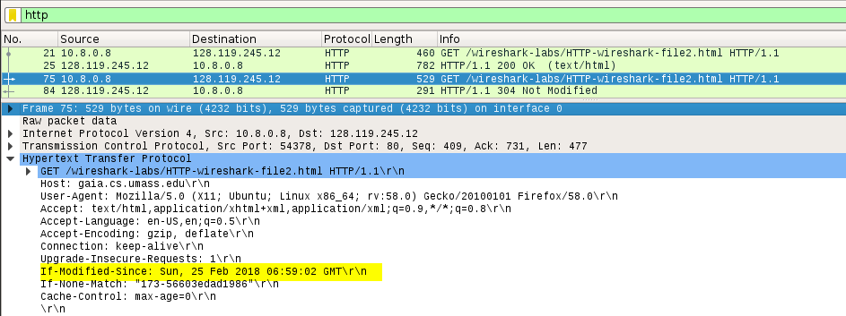

# HTTP

## A. The Basic HTTP GET/RESPONSE interaction

***Figure 1: HTTP GET request to http://gaia.cs.umass.edu/wireshark-labs/HTTP-wireshark-file1.html***  

1. **Is your browser running HTTP version 1.0 or 1.1? What version of HTTP is the server running? What languages (if any) does your browser indicate that it can accept to the server?**

  **Answer :** Both browser and server are running **HTTP version 1.1**. The languages accepted by brower are **en-us** and **en**.

2. **What is the IP address of your computer? Of the gaia.cs.umass.edu server?**

  **Answer :** My IP address is **10.8.0.8** and the server’s is **128.119.245.12**.

3. **What is the status code returned from the server to your browser?**

  **Answer :** HTTP/1.1 200 OK (text/html).

***Figure 2: HTTP response from http://gaia.cs.umass.edu/wireshark-labs/HTTP-wireshark-file1.html***  

4. **When was the HTML file that you are retrieving last modified at the server?**

  **Answer :** Last-Modified: Sun, 18 Feb Jun 2018 06:59:01 GMT

5. **How many bytes of content are being returned to your browser?**

  **Answer :** Content-Length: 128

## B. The HTTP CONDITIONAL GET/RESPONSE interaction

 

***Figure 3: Contents of the first HTTP GET request to http://gaia.cs.umass.edu/wireshark-labs/HTTP-wireshark-file2.html***  

7. **Inspect the contents of the first HTTP GET request from your browser to the server. Do you see an “IF-MODIFIED-SINCE” line in the HTTP GET?**

   **Answer :** No

***Figure 4: Response message of the first HTTP GET request from  http://gaia.cs.umass.edu/wireshark-labs/HTTP-wireshark-file2.html***  

8. **Inspect the contents of the server response. Did the server explicitly return the**
   **contents of the file? How can you tell?**

   **Answer :** Yes because we can see the contents in the **Line-based text data field**.

***Figure 5: Contents of the second HTTP GET request to http://gaia.cs.umass.edu/wireshark-labs/HTTP-wireshark-file2.html***  

9. **Now inspect the contents of the second HTTP GET request from your browser to the server. Do you see an “IF-MODIFIED-SINCE:” line in the HTTP GET? If so, what information follows the “IF-MODIFIED-SINCE:” header?**

   **Answer :** Yes. The information following the**"IF-MODIFIED-SINCE:"** header is: Sun, 25 Feb 2018 6:59:02 GMT which is the date of the last modification of the file from the previous get request.

***Figure 6: Response message of the second HTTP GET request from  http://gaia.cs.umass.edu/wireshark-labs/HTTP-wireshark-file2.html***

10. **What is the HTTP status code and phrase returned from the server in response to this second HTTP GET? Did the server explicitly return the contents of the file?Explain.**

  **Answer :** The status code and phrase returned from the server is **HTTP/1.1 304 Not  Modified.** The server didn’t return the contents of the file since the browser loaded it from its cache.
