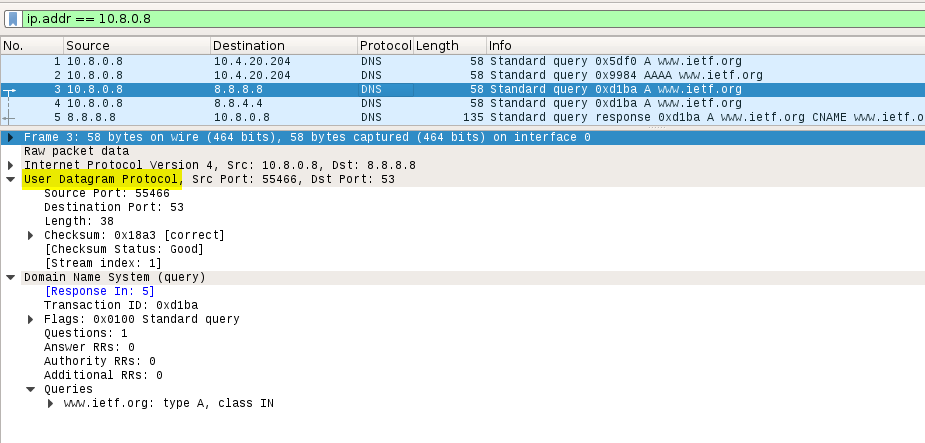

# DNS

## A. Tracing DNS with Wireshark

***Figure 1: Output of ifconfig, ip address is 10.8.0.8***  

***Figure 2: DNS Query message to http://www.ietf.org***  

1. **Locate the DNS query and response messages. Are they sent over UDP or TCP?**

  **Answer :** They are sent over **UDP**.

***Figure 3: DNS response message from http://www.ietf.org***

2. **Examine the DNS response message. How many “answers” are provided? What does each of these answers contain?**

  **Answer :** There were **3 answers** containing information about the **name of the host, the type of address, class, the TTL, the data length and the IP address**.

***Figure 4: TCP SYN packet sent by my host***

3. **Consider the subsequent TCP SYN packet sent by your host. Does the destination IP address of the SYN packet correspond to any of the IP addresses provided in the DNS response message?**

  **Answer :** The first SYN packet was sent to **104.20.0.85** which corresponds to the first IP address provided in the DNS response message.

4. **This web page contains images. Before retrieving each image, does your host issue new DNS queries?**

  **Answer :** No, host doesn't issue queries for each image, it issues mutiple DNS requests.

5. **Sort the queries according to their DNS response time. Attach screenshot along with it.**

   **Answer :** 

***Figure 5: Sorted queries according to their DNS response time***

## B. Tracing DNS with **nslookup**

 

***Figure 6: nslookup Output***

 

***Figure 7: DNS Query Message***

6. **What is the destination port for the DNS query message? What is the source port of DNS response message?**

   **Answer :** The destination port of the DNS query is 53 and the source port of the DNS response is 53.

***Figure 8: DNS Response Message***

7. **Examine the DNS query message. What “Type” of DNS query is it? Does the query message contain any “answers”? If yes, then how many “answers” are provided? What   does each of these answers contain?**

   **Answer :** The query is of **type A**. **No**, it doesn’t contain any answers.

8. **Examine the DNS response message. What “Type” of DNS query is it? Does the response message contain any “answers”? If yes, then how many “answers” are provided? What does each of these answers contain?**

   **Answer :** The query is of **type A**.  **Yes**, the response DNS message contains **one answer** containing the **name of the host, the type of address, the class, TTL, data length and the IP address**. 

## C. Tracing DNS with **nslookup –type=NS**

 

***Figure 9: nslookup –type=NS mit.edu Output***

 

***Figure 10: DNS Query Message***

9. **To what IP address is the DNS query message sent? Is this the IP address of your default local DNS server?**

   **Answer :** It was sent to **10.4.20.222** which is my default DNS server.

***Figure 11: DNS Response Message***

10. **Examine the DNS query message. What “Type” of DNS query is it? Does the query message contain any “answers”?**

  **Answer :** It’s a **type NS** DNS query. **No**, it doesn’t contain any answers.

11. **Examine the DNS response message. What MIT name servers does the response message provide? Does this response message also provide the IP addresses of the MIT name servers?**

    **Answer :** The nameservers are **use2, asia2, usw2 and eur5**. **Yes**, we can find their IP addresses if we expand the Additional records field in Wireshark as seen above.