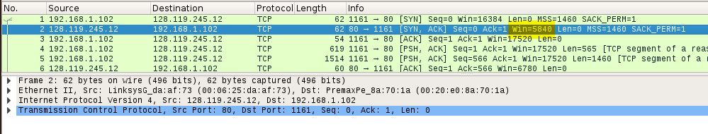

# TCP

   ***Figure 1: IP addresses and TCP port numbers of the client computer and gaia.cs.umass.edu***                                                              

1. **What is the IP address and TCP port number used by the client computer (source) that is transferring the file to gaia.cs.umass.edu?**

  **Answer :** **IP address** is **192.168.1.102** and TCP **port number** is **1161**

2. **What is the IP address of gaia.cs.umass.edu? On what port number is it sending and receiving TCP segments for this connection?**

  **Answer :**  **IP address** is **128.119.245.12** and TCP **port number** is **80**

3. **What is the sequence number of the TCP SYN segment that is used to initiate the TCP connection between the client computer and gaia.cs.umass.edu? What is it in the segment that identifies the segment as a SYN segment?**

  **Answer :**Sequence number of the TCP SYN segment is used to initiate the TCP connection between the client computer and gaia.cs.umass.edu. The **value is 0** in this trace. The **SYN flag is set to 1** and it indicates that this segment is a SYN segment.

​                                         ***Figure 2: Sequence number of the TCP SYN segment***

2. **What is the sequence number of the SYNACK segment sent by gaia.cs.umass.edu to the client computer in reply to the SYN? What is the value of the Acknowledgement field in the SYNACK segment? How did  gaia.cs.umass.edu  determine that value? What is it in the segment that identifies the segment as a SYNACK segment?**

  **Answer :** Sequence number of the SYNACK segment from gaia.cs.umass.edu to the client computer in reply to the **SYN has the value of 0** in this trace. The value of the **ACKnowledgement field** in the **SYNACK segment is 1**. The value of the ACKnowledgement field in the SYNACK segment is determined by gaia.cs.umass.edu by adding 1 to the initial sequence number of SYN segment from the client computer (i.e.the sequence number of the SYN segment initiated by the client computer is 0.). The **SYN flag and Acknowledgement flag in the segment are set to 1** and they indicate that this segment is a SYNACK segment.

***Figure 3: Sequence number and Acknowledgement number of the TCP SYNACK segment***

3. **What is the sequence number of the TCP segment containing the HTTP POST command?**

  **Answer :**  No. 4 segment is the TCP segment containing the HTTP POST command. The **sequence number** of this segment has the value of **1**.

​           ***Figure 4: Sequence number of the TCP segment containing the HTTP POST command***

4. **What is the length of each of the first six TCP segments?**

  **Answer :** Length of the **first TCP segment** (containing the HTTP POST): **565 bytes** and length of each of the **other five TCP segments**: **1460 bytes (MSS)**.

​                                                             ***Figure 5:Lengths of segments 1 - 6***

5. **What is the minimum amount of available buffer space advertised at the received for the entire trace? Does the lack of receiver buffer space ever throttle the sender?**

   **Answer :** The minimum amount of buffer space (receiver window) advertised at gaia.cs.umass.edu for the entire trace is **5840 bytes**, which shows in the **first acknowledgement** from the server. This receiver window grows steadily until a **maximum receiver buffer size of 62780 bytes**. The sender is **never throttled** due to lacking of receiver buffer space by inspecting this trace. 

​                              ***Figure 6: Minimum receive window advertised at gaia.cs.umass.edu***

​                            ***Figure 7: Maximum receive window advertised at gaia.cs.umass.edu***

6. **Are there any retransmitted segments in the trace file? What did you check for (in the trace) in order to answer this question?**

   **Answer :** There are no retransmitted segments in the trace file. We can verify this by checking the sequence numbers of the TCP segments in the trace file. In the **Time-Sequence-Graph (Stevens)** of this trace, **all sequence numbers** from the source (192.168.1.102) to the destination (128.119.245.12) are **increasing monotonically with respect to time**. If there is a retransmitted segment, the sequence number of this retransmitted segment should be smaller than those of its neighboring segments

***Figure 8: Sequence numbers of the segments from the source (192.168.1.102) to the destination***
***(128.119.245.12)***