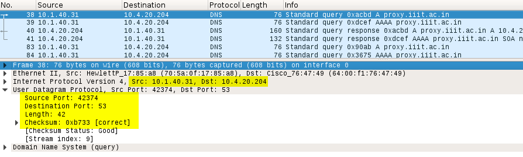
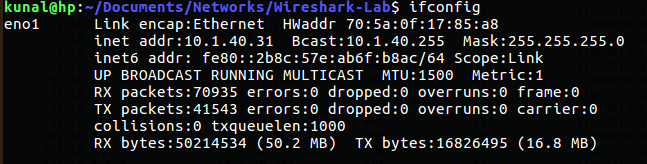
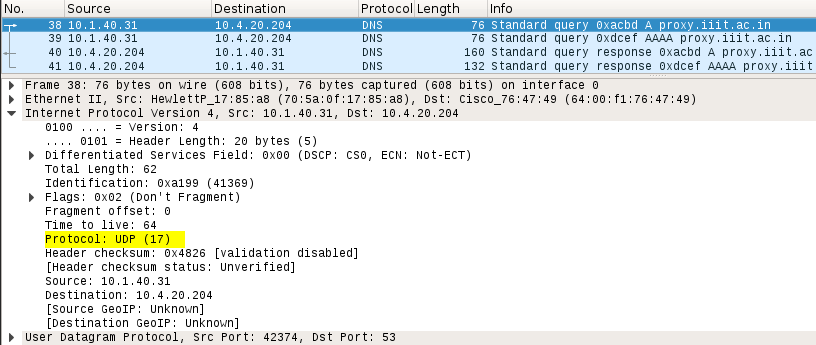
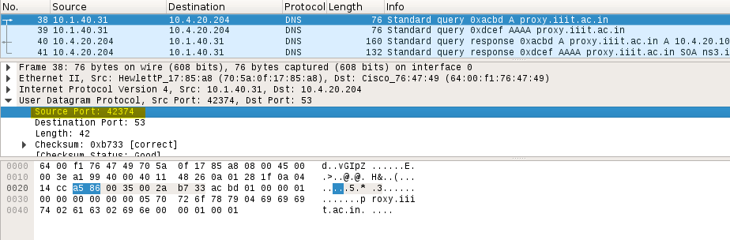
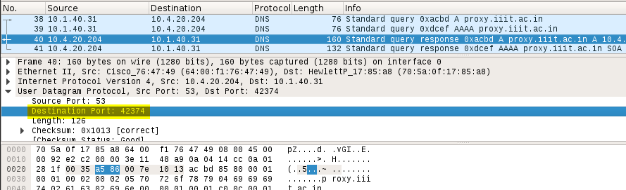

# UDP

​                                                       ***Figure 1: UDP Header Fields***                                                              
1. **Select one packet. From this packet, determine how many fields are there in the UDP header. Name these fields**.

  **Answer :** UDP header contains 4 fields:

  - Source port
  - Destination port
  - Length
  - Checksum

2. **The value in the length field is the length of what? Verify your claim with the captured UDP packet.**

  **Answer :** The value in the length field is the sum of the 8 header bytes, plus the 34 encapsulated data
  bytes.

3. **Observe the source address. Verify that the source address is your IP address.**

  **Answer : **The source address is 10.1.40.31 which is same as my IP address.

​                                                         ***Figure 2: My IP address using ifconfig***

4. **Observe the destination address.**

  **Answer :** The destination address is 10.4.20.204

5. **What is the maximum number of bytes that can be included in a UDP payload?**

  **Answer :**  The maximum number of bytes that can be included in a UDP payload is 216 – 1 less the header bytes. This gives 65535 – 8 = 65527 bytes..

6. **What is the largest possible port number?**

  **Answer :** The largest possible source port number is 216 – 1 = 65535.

7. **What is the protocol number for UDP?**

   **Answer :** The IP protocol number for UDP is 0x11 hex, which is 17 in decimal value.

​                                                       ***Figure 3: Protocol number of UDP***

8. **Search “UDP” on google and determine the fields on which the UDP checksum is calculated.**

  **Answer :** The UDP checksum is calculated as the 16-bit one’s complement of the one’s complement sum of a pseudo header of information from the IP header, the UDP header, and the data. This is padded as needed with zero bytes at the end to make a multiple of two bytes. If the checksum is computed to be 0, it must be set to 0xFFFF.

9. **Examine a pair of UDP packets in which the first packet is sent by your host and the second packet is a reply to the first packet. Describe the relationship between the port numbers in the two packets.**

​                                                                 ***Figure 4: UDP sent by my host***

​                                                             ***Figure 5: UDP reply to my host***

​	**Answer :** The source port of the UDP packet sent by the host is the same as the 	destination port of the reply packet, and conversely the destination port of the UDP packet sent by the host is the same as the source port of the reply packet.